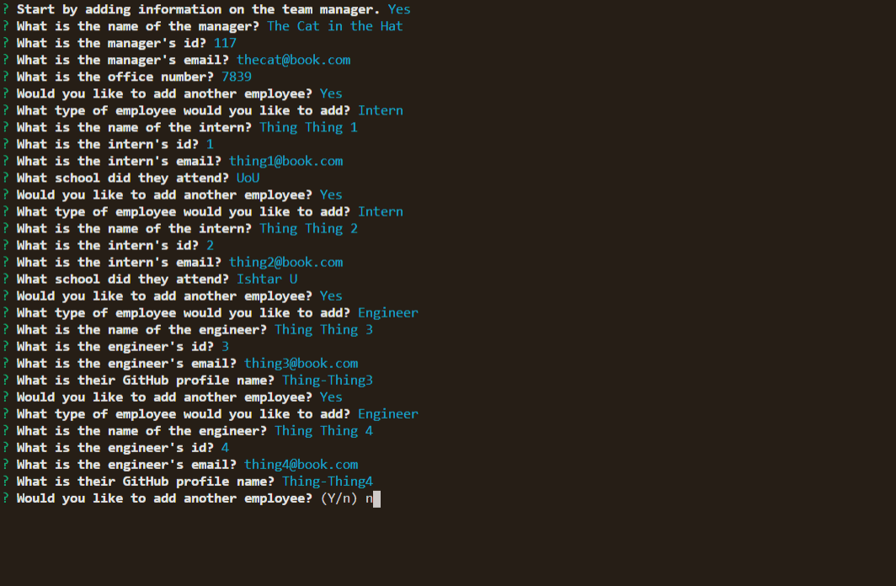

# Team Profile Generator

This command line application  takes user input to dynamically create an html file containing information on a software development team. It was a great way to practice using inquirer npm, taking advantage of multiple js files, and working with classes and constructors.

## Installation:

- Use GitHub's feature set to get the files on your local machine
- In your command line, run nmp i to install the necessary modules
- Then run npm start to run the application

## Objective:

- Create a CLI app that prompts a user about employee information
- Use that user prompts to create objects utilizing classes and constructors
- Use the new constructor instances to dynamically create an HTML text
- Use that text to create and html file for the user to utilize

[Team Profile Generator](https://github.com/Diegopie/Team-Profile-Generator/) is hosted on GitHub.

## Outcome: 

Working with tests.js files was new for me. I still need some more practice for writing tests but I feel more confident in test driven development. This project very much opened my third eye when it comes to working with classes and constructors. At first, the were my enemy. Now I see them as an ally, even a friend.

## Collaborators:

This application relies on Bootstrap, Inquirer NPM and Jest NPM.

This application was authored by [Diego Hernandez](https://github.com/Diegopie)